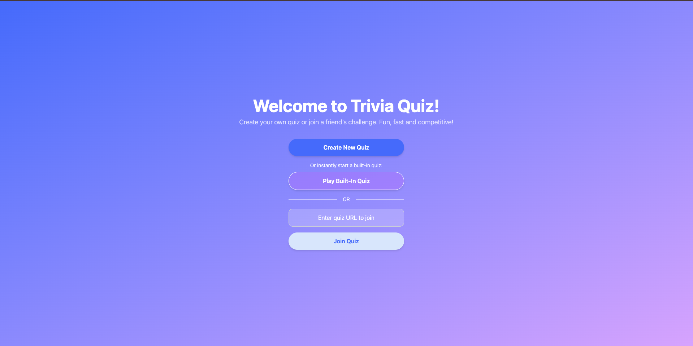
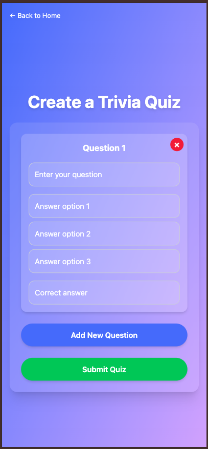
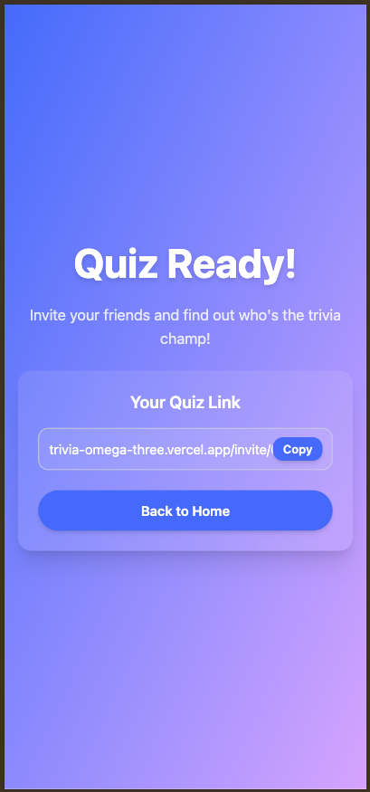
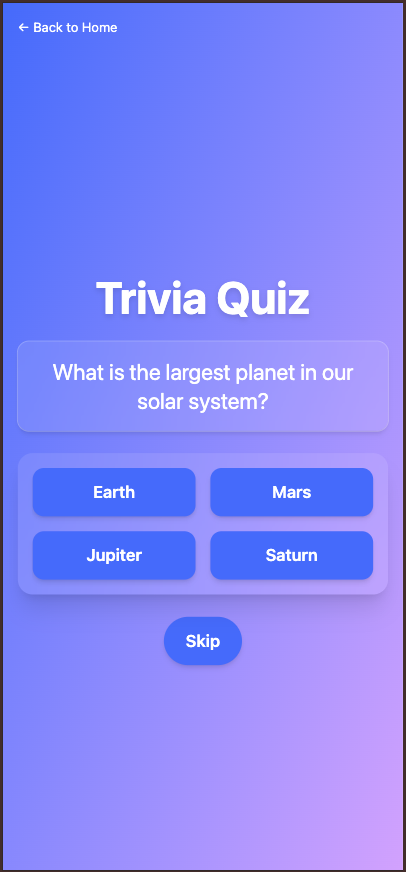
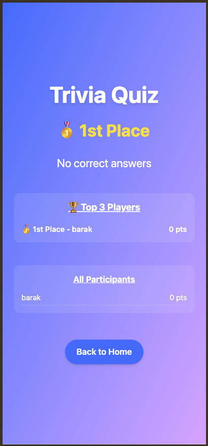

# Trivia App

An interactive, full-stack trivia quiz platform built with React and Node.js.  Users can create custom quizzes, share via a unique link, and play without any sign-up.

> ✅ No registration required—just create a quiz, copy the share link, and challenge your friends!
> 
> ✅ Or instantly try the built-in example quiz from the home page!

🚀 **Live Demo:**
Currently available locally. Deploy to Vercel/Render for an online demo.
👉 [https://trivia-omega-three.vercel.app](https://trivia-omega-three.vercel.app)

---

## ✨ Features

### 📝 Quiz Creation

- Design custom quizzes with any number of questions
- Automatic generation of a unique quiz ID and link

### 🔍 Quiz Participation

- Join any quiz via its unique URL
- Enter a nickname and start playing instantly
- Real-time validation of quiz ID before start

### 📊 Results & Sharing

- View final score and ranking
- Copy-to-clipboard button for easy link sharing
- Direct navigation back to home for new quizzes

### 🗑️ Automatic Cleanup

- MongoDB TTL index deletes quizzes 2 hours after creation
- Keeps the database clean without extra scripts

---

## 🎯 Built-In Example Quiz
- In addition to creating your own quiz, you can instantly start playing using a built-in quiz that's already available in the app.
- Click **Play Built-In Quiz** on the home page to start immediately.

---

## 🖼️ Screenshots

> Below are snapshots from the app in action:

### Home Page (Desktop)


### Create Quiz


### Share Quiz Link


### Game in Progress


### Game Over Summary


---

## 📂 Technologies

### Frontend

- React + Vite
- Tailwind CSS
- Axios
- React Router DOM
- Notyf (Notifications)

### Backend

- Node.js + Express
- MongoDB + Mongoose
- Joi (Validation)
- dotenv
- CORS

---

## 📁 Project Structure

```
Root Directory
│
├── package.json
├── .gitignore
├── README.md
├── frontend/
│   ├── package.json
│   ├── vite.config.js
│   ├── .gitignore
│   ├── .env
│   ├── eslint.config.js
│   ├── vercel.json
│   ├── index.html
│   ├── public/
│   └── src/
│       ├── main.jsx
│       ├── App.jsx
│       ├── App.css
│       ├── utils/
│       │   ├── api.js
│       │   ├── AuthContext.jsx
│       │   └── ProtectedRoute.jsx
│       ├── components/
│       │   ├── Loading.jsx
│       │   └── Error.jsx
│       └── pages/
│           ├── Home.jsx
│           ├── CreateQuiz.jsx
│           ├── QuizRedirect.jsx
│           ├── Login.jsx
│           ├── Game.jsx
│           ├── Gameover.jsx
│           ├── ShareQuiz.jsx
│           └── NotFound.jsx
│
└── backend/
    ├── package.json
    ├── .gitignore
    ├── .env
    └── src/
        ├── index.js
        ├── config/
        │   └── dbConfig.js
        ├── models/
        │   └── quizModel.js
        ├── controllers/
        │   └── quizController.js
        ├── routes/
        │   └── quizRoutes.js
        └── utils/
            └── builtInQuiz.js

```

---

## 🚀 Installation & Setup

### 1. Clone the repository

```bash
git clone https://github.com/barak7821/trivia-app.git
```

### 2. Navigate into the project folder

```bash
cd trivia-app
```

### 3. Install dependencies (run from **root** folder)

```bash
npm install
```

**Make sure to execute this command from the root directory of the project.**  This will install both frontend and backend packages via the root scripts.

### 4. Create environment files

#### Backend `.env`

```env
PORT=your_port

MONGODB_URI=your_mongodb_connection_string
```

#### Frontend `.env`

```env
VITE_BACKEND_URL=your_backend_url


VITE_FRONTEND_URL=your_frontend_url
```

### 5. Run the application (from **root** folder)

```bash
npm run dev
```

This will start both the backend and frontend servers concurrently using **npm-run-all** and **concurrently**. Make sure to run this command from the **main project folder**, not from the `frontend/` or `backend/` subfolders. The frontend output will be shown in blue, and the backend in green.
